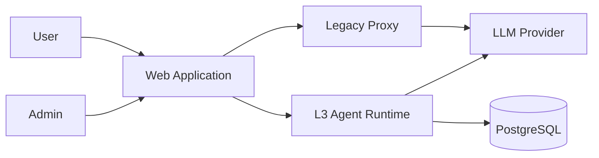
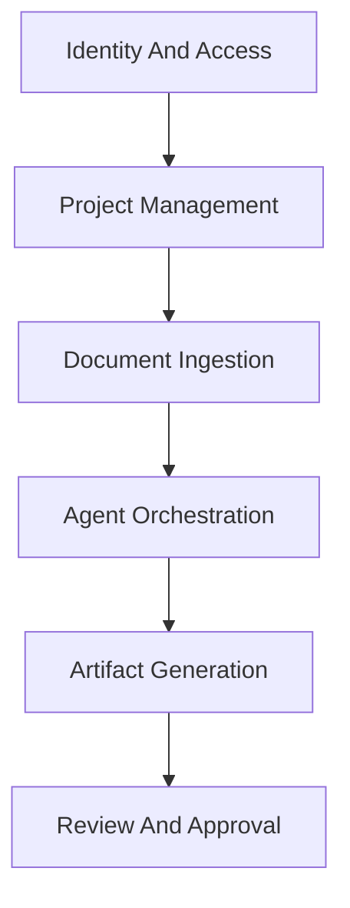

# Architecture Document

Version 1.0 | July 2026 | Prepared by: Engineering & Architecture Team

> This is the condensed, Markdown-format companion to the full Word Architecture Document
> (`docs/Agentic-SDLC-Architecture.docx`, 21 sections, 13 diagrams), produced because this specific
> AppDocs prompt explicitly targets an `ARCHITECTURE.md` file rather than Word. Where a section below
> is brief, the full Word document has the complete current-state/target-state detail, ADR log, and
> Risks and Mitigations table across all 15 architecture areas.

## 1. Introduction

### 1.1 Purpose

This document exists to give technical architects, engineering leads, and delivery stakeholders a single,
current source of truth for how the Agentic SDLC Framework is built today and where it is headed. It should
be read before making any change that touches the pipeline, storage, security, or deployment model.

### 1.2 Scope

Covers the full application: the 30-agent, 11-phase pipeline, dual-backend services, storage model, RBAC,
security posture, CI/CD, and identified target-state improvements. Does not cover the separately-planned
Document Agent feature (see `docs/Document-Agent-Feature-Plan.md`), which is still pending approval.

### 1.3 Definitions, Acronyms, and Abbreviations

| Term | Definition |
|---|---|
| L3 Runtime | The Plan-Act-Observe agent execution loop (`frontend/src/services/l3Runtime.ts`) |
| AppRole | Per-project role: `project_owner`, `editor`, `reviewer`, `viewer` |
| isAdmin | Platform-wide admin flag, independent of AppRole |
| Review Gate | Human-approval checkpoint between pipeline phases |
| RTM | Requirements Traceability Matrix (see `frontend/src/services/traceability.ts`) |

### 1.4 References

- `docs/Agentic-SDLC-Architecture.docx` — the full Word architecture document this file condenses.
- `frontend/src/agents/definitions.ts` — the 30-agent registry.
- `docs/Document-Agent-Feature-Plan.md` — pending feature plan, not yet approved.

## 2. Architectural Goals and Constraints

### 2.1 Business Goals

Faster, more consistent SDLC artifact production; documentation that stays traceable to the current
codebase; human approval preserved at every phase transition; reusable per-project domain knowledge.

### 2.2 Technical Constraints

LLM provider rate limits (5 concurrent agents, 1.5s stagger); single Railway instance per backend service
with no autoscaling observed; browser-local Dexie/IndexedDB storage alongside PostgreSQL.

### 2.3 Non Functional Requirements

| Category | Requirement | Current State | Target State | Confidence |
|---|---|---|---|---|
| Observability | Structured, queryable logs | Console-log only | Structured logger + APM | High (gap confirmed) |
| Reliability | No tool-call-leak failures | Fixed this engagement | Automated regression test | High |
| Security | No production admin-bypass path | Dev-only by convention | Build-time enforced guarantee | Medium |

## 3. System Overview

### 3.1 Context Diagram

Matches the confirmed dual-backend architecture: a React SPA talking to a legacy Express proxy and a
separate TypeScript L3 Agent Runtime, both calling out to an LLM provider.

### 3.2 High Level Description of Functionality

Project creation, document upload/parsing (.pdf/.docx/.txt/.xlsx/.xls/.csv), structured project-context
extraction, 30-agent pipeline execution across 11 phases, human review gates between phases, artifact
export (Markdown/Word/PDF/ZIP), and role-based access control.

## 4. Architectural Views

### 4.1 Conceptual and Logical View

Key domains: Identity and Access, Project Management, Document Ingestion, Domain Knowledge, Agent
Orchestration, Artifact Generation, Review and Approval.

### 4.2 Component and Container View

Full detail (services, APIs, data layer, external layer) is in the Word Architecture Document, Section 3
(Target-State Architecture) and Section 5-6 (Frontend/Backend Architecture).

### 4.3 Deployment and Infrastructure View

GitHub Actions CI (backend tsc+jest+migration, frontend tsc+vitest 90% coverage, shared-types tsc); Vercel
for frontend hosting; Railway for proxy and Agent Runtime services. See Word document Section 14 for the
full deployment diagram and CI/CD detail.

### 4.4 Security View

RBAC via AppRole plus platform-wide isAdmin; auth resolved via a precedence chain (admin-bypass dev-only,
invite-session bearer, Supabase JWT, unauthenticated). Full detail in Word document Section 13.

### 4.5 Data View

Dual storage: Dexie/IndexedDB (browser-local) plus PostgreSQL (durable/shared). ERD and lifecycle detail in
this pack's Data Model / ERD Document (#23) and the Word document Section 11.

## 5. Key Architectural Decisions

See the Word Architecture Document Section 17.1 (ADR Log) for four fully-detailed entries (review-gate
hard-gating, CSP frame-src fix, agent iteration-budget resizing, inline-SVG icon requirement), and this
pack's Decision Log (#08) for the same decisions in Decision Log format.

## 6. Interfaces and Integrations

Internal: legacy proxy ↔ L3 Agent Runtime. External: LLM provider, Supabase (via `server/`, production
wiring unconfirmed). Full detail in this pack's Integration Design Document (#25).

## 7. Operational Architecture

### 7.1 CI/CD Pipeline Overview

Three parallel GitHub Actions jobs (backend, frontend, shared-types) on every push/PR. Whether a red run
blocks a live Vercel/Railway deploy remains an open question (Word document Section 17.2).

### 7.2 Monitoring, Logging, and Alerting

Console-log only today; no APM, error tracking, or alerting. The single highest-priority target-state gap
identified across this entire document set.

### 7.3 Scaling and Capacity Planning

Single instance per backend service; concurrency capped at 5 parallel agents. Target-state: job-queue-based
execution and horizontal scaling (Word document Section 16).

## 8. Evolution and Future Considerations

| Area | Current Limitation | Target Improvement | Priority | Confidence |
|---|---|---|---|---|
| Observability | Console-log only | Structured logging + APM | High | High |
| Scalability | Single instance, no queue | Job queue + autoscaling | Medium | Medium |
| Gate enforcement | UI-level only | Confirmed server-side enforcement | Medium | Medium |

## 9. Appendices

### Appendix A. Glossary

See Section 1.3.

### Appendix B. Detailed Diagrams

All 13 diagrams referenced by this document live in the full Word Architecture Document.

### Appendix C. References and Further Reading

See Section 1.4.

### Appendix D. Open Questions

- Is `POSTGRES_URL` (production) the same database as `server/`'s Supabase connection?
- Is `server/` deployed as its own Railway service in production?
- Does a failing GitHub Actions run block a live deploy?
- Does the invite-session bearer token expire or get revoked independent of the Supabase JWT?

### Appendix E. Assumptions

- This document reflects the codebase state as reviewed in July 2026; changes deployed after that are not
  reflected.
- Target-state items (job queue, APM, autoscaling) are recommendations, not committed roadmap.

## Output Summary

1. This file is the Markdown-format Architecture Document for the AgenticSDLC_Docs pack.
2. Diagrams: 2 (Context Diagram, Conceptual/Logical View) inline here; the remaining 11 referenced from the
   full Word document rather than duplicated, to avoid drift between two competing copies of the same
   diagrams.
3. Assumptions: see Appendix E.
4. Open questions: see Appendix D.
5. Confidence level: **0.85** — high on all sections directly sourced from the Word document (already
   verified this engagement); slightly lower where this file condenses rather than fully restates detail.
