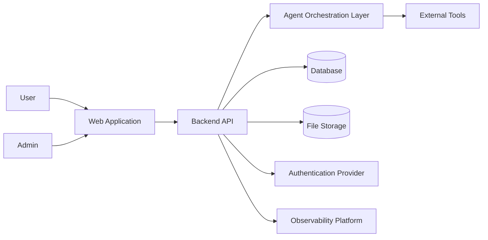
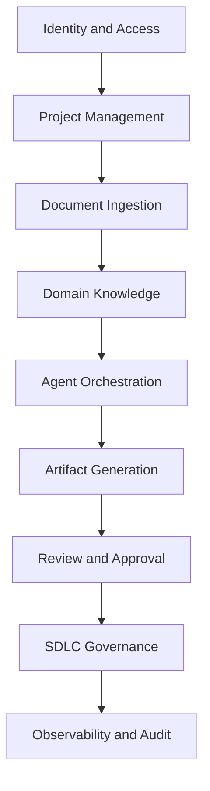
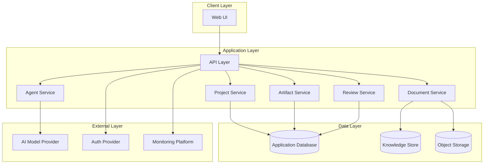
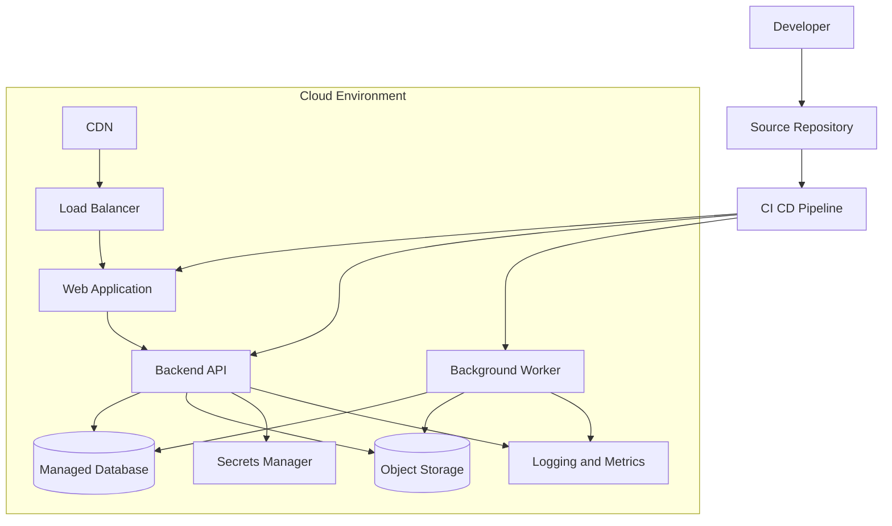
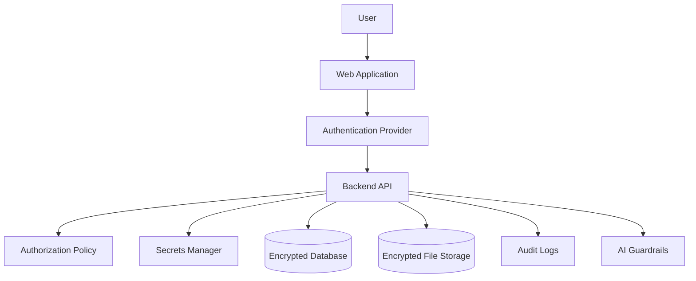
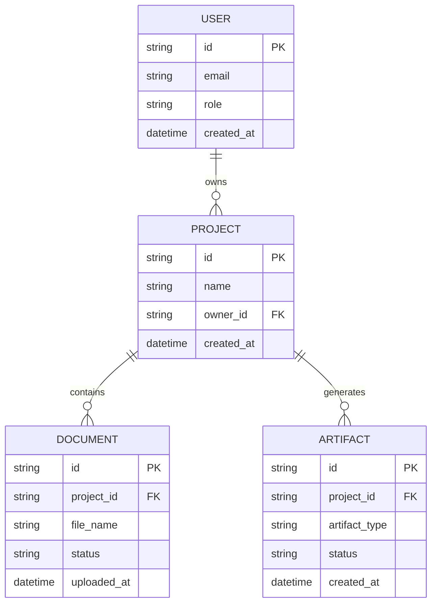
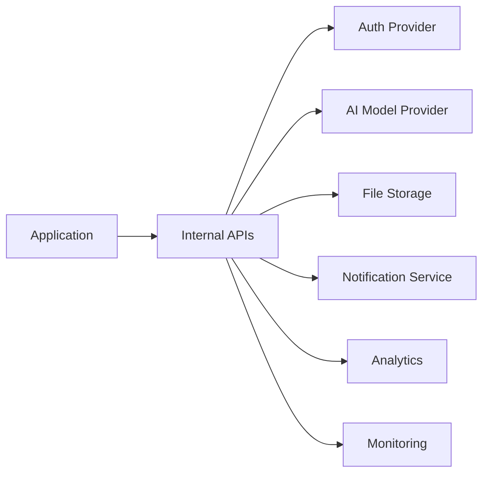
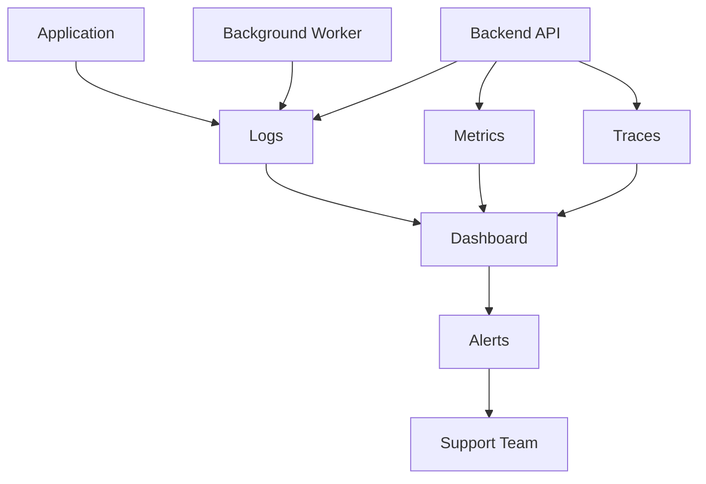

# Enhanced Prompt - Update Architecture Document Markdown

## Prompt

You are a senior enterprise solution architect, AI architect, and technical documentation lead.

Update the existing `ARCHITECTURE.md` file by merging the best structure, clarity, and content from the architecture outline provided below. Preserve valid existing content, improve weak sections, remove duplication, add missing architecture views, and make the document ready for review by technical architects.

## Identity Context

Act as a world-class enterprise architect and engineering documentation reviewer. Write like a senior engineering leader. Be precise, structured, practical, and technically credible.

## World Context

The audience is technical architects, senior engineers, DevOps leads, security architects, QA leads, product owners, delivery leaders, and engineering directors. They will review the document for architecture quality, technical feasibility, security, scalability, operational readiness, traceability, and implementation clarity.

## Task Context

Update the existing architecture Markdown file directly.

Merge the best of the following structure into the current document:

1. Introduction
2. Architectural Goals and Constraints
3. System Overview
4. Architectural Views
5. Key Architectural Decisions
6. Interfaces and Integrations
7. Operational Architecture
8. Evolution and Future Considerations
9. Appendices

The final document must include both current-state and target-state architecture where relevant.

Do not rewrite blindly. First inspect the existing architecture document and preserve accurate, useful content. Improve the document by reorganizing, strengthening, and completing it.

## Required Final Document Structure

Use this structure unless the existing document already has a better equivalent structure. If an existing section is useful, merge it into the closest section below.

# Architecture Document

## 1. Introduction

### 1.1 Purpose

Explain why this architecture document exists, who it is for, and how it should be used.

### 1.2 Scope

Define what the architecture covers and what it does not cover.

Include:

- Application scope
- System boundaries
- Included modules
- Excluded capabilities
- Current-state scope
- Target-state scope

### 1.3 Definitions, Acronyms, and Abbreviations

Create a glossary table for domain terms, architecture terms, AI/agentic terms, and technical abbreviations.

### 1.4 References

List references such as:

- Product requirements
- Business requirements
- API documentation
- Deployment guides
- Security standards
- Codebase folders
- External platform documentation

If references are not available, mark them as open questions.

## 2. Architectural Goals and Constraints

### 2.1 Business Goals

Describe business outcomes the architecture must support.

Include:

- Productivity improvement
- Delivery quality
- Faster artifact generation
- Better traceability
- Human approval and governance
- Reusable project/domain knowledge
- Enterprise readiness

### 2.2 Technical Constraints

Document known constraints.

Include:

- Budget constraints
- Timeline constraints
- Team skill constraints
- Hosting constraints
- Cloud/platform constraints
- Compliance constraints
- Integration constraints
- AI model limitations
- Data privacy constraints

### 2.3 Non Functional Requirements

Document measurable quality expectations.

Include:

- Performance
- Scalability
- Availability
- Reliability
- Security
- Privacy
- Maintainability
- Observability
- Accessibility
- Compliance
- Cost efficiency
- Extensibility

Use a table with columns:

| Category | Requirement | Current State | Target State | Measurement | Confidence |
|---|---|---|---|---|---|

## 3. System Overview

### 3.1 Context Diagram

Add a Mermaid context diagram showing:

- Primary users
- Web application
- Backend APIs
- AI/agent orchestration layer
- Document ingestion
- Artifact generation
- Database
- File storage
- External systems
- Authentication provider
- Observability platform

Use safe Mermaid syntax.

### 3.2 High Level Description of Functionality

Explain what the system does in business language and technical language.

Include:

- Project creation
- Document upload and parsing
- Project context extraction
- Agentic planning and orchestration
- Artifact generation
- Human approval checkpoints
- SDLC document generation
- Traceability and reuse
- Security and governance
- Deployment and operations

## 4. Architectural Views

## 4.1 Conceptual and Logical View

### 4.1.1 Key Domains and Bounded Contexts

Identify key domains.

Recommended domains:

- Identity and Access
- Project Management
- Document Ingestion
- Domain Knowledge
- Agent Orchestration
- Artifact Generation
- Review and Approval
- SDLC Governance
- Observability and Audit

Add diagram:

### 4.1.2 Major Subsystems and Responsibilities

Use a table:

| Subsystem | Responsibility | Current State | Target State | Risks | Owner |
|---|---|---|---|---|---|

## 4.2 Component and Container View

Describe UI apps, APIs, services, databases, storage, AI services, background workers, and integration points.

Include:

- Services
- APIs
- Databases
- UI apps
- Communication patterns
- Sync vs async interactions
- Protocols
- Error handling responsibilities

Add diagram:

## 4.3 Deployment and Infrastructure View

Document environments and deployment model.

Include:

- Dev
- Test
- UAT
- Production
- Cloud region
- Hosting model
- Containers or serverless
- Databases
- Network boundaries
- Load balancers
- CDN
- Secrets
- Backup
- Disaster recovery

Add current-state and target-state deployment diagrams.

Current-state diagram must reflect known implementation. If unknown, mark as assumption.

Target-state example:

## 4.4 Security View

Document security architecture.

Include:

- Authentication
- Authorization
- Role based access
- Least privilege
- Secrets management
- Data encryption at rest
- Data encryption in transit
- File upload security
- Input validation
- AI prompt safety
- Audit logging
- Compliance considerations
- SOC 2 readiness
- HIPAA only if applicable
- Data privacy controls

Add diagram:

## 4.5 Data View

Document data architecture.

Include:

- Data stores and their roles
- Uploaded documents
- Extracted project context
- Domain knowledge
- Generated artifacts
- User and role data
- Audit data
- Retention
- Backup
- Data lineage
- Data quality
- Data privacy

Add ERD if entities are known. Use safe Mermaid ER syntax.

## 5. Key Architectural Decisions

Add or update Architecture Decision Records.

For each decision, include:

- Decision title
- Status
- Context
- Constraints
- Options considered
- Decision
- Rationale
- Consequences
- Trade-offs
- Revisit trigger

Use this table:

| ID | Decision | Status | Rationale | Trade Offs | Revisit Trigger |
|---|---|---|---|---|---|

Include decisions such as:

- Modular architecture over tightly coupled design
- Agent orchestration layer
- Human approval before final artifact generation
- Persistent project context
- Mermaid based architecture diagrams
- Secure document ingestion pipeline
- Observability from early stages
- Current state to target state evolution

Do not invent decisions as completed. Mark unknown decisions as proposed.

## 6. Interfaces and Integrations

Document internal and external interfaces.

Include:

- Internal APIs
- External systems
- AI model provider
- Authentication provider
- File storage
- Email or notification service
- Analytics
- Monitoring
- Data contracts
- Versioning strategy
- Error handling
- Retry strategy

Add diagram:

## 7. Operational Architecture

## 7.1 CI CD Pipeline Overview

Document build, test, scan, package, deploy, validate, and rollback.

```mermaid
flowchart LR
    Code[Code Commit]
    Build[Build]
    UnitTest[Unit Tests]
    SecurityScan[Security Scan]
    Package[Package Artifact]
    DeployTest[Deploy to Test]
    Validate[Validate]
    Approval[Approval Gate]
    DeployProd[Deploy to Production]
    Monitor[Monitor]

    Code --> Build
    Build --> UnitTest
    UnitTest --> SecurityScan
    SecurityScan --> Package
    Package --> DeployTest
    DeployTest --> Validate
    Validate --> Approval
    Approval --> DeployProd
    DeployProd --> Monitor
```

## 7.2 Environments and Promotion Strategy

Document:

- Local
- Dev
- QA
- UAT
- Staging
- Production
- Promotion rules
- Data refresh rules
- Access rules

## 7.3 Monitoring, Logging, and Alerting

Document:

- Logs
- Metrics
- Traces
- Dashboards
- Alerts
- Error handling
- Audit logs
- SLA and SLO visibility

Add diagram:

## 7.4 Scaling and Capacity Planning

Document:

- Horizontal scaling
- Vertical scaling
- Queue based processing
- Background jobs
- Database scaling
- File processing constraints
- AI rate limits
- Cost controls
- Capacity assumptions

## 8. Evolution and Future Considerations

Document known limitations, planned improvements, and technical debt.

Include:

- Current limitations
- Target-state improvements
- Scalability enhancements
- Security hardening
- AI governance maturity
- Observability improvements
- Deployment maturity
- Performance improvements
- Technical debt items
- Architecture roadmap

Use table:

| Area | Current Limitation | Target Improvement | Priority | Risk | Confidence |
|---|---|---|---|---|---|

## 9. Appendices

## Appendix A. Glossary

Include business, architecture, AI, and technical terms.

## Appendix B. Detailed Diagrams

Move large or detailed diagrams here if they interrupt readability.

## Appendix C. References and Further Reading

List all references. Mark missing references as open questions.

## Appendix D. Open Questions

List unresolved architecture questions.

## Appendix E. Assumptions

List assumptions separately from confirmed facts.

## Mermaid Safety Rules

Before finalizing, validate every Mermaid block.

Avoid:

- Parentheses inside node labels
- Quotes inside node labels
- Colons inside node IDs
- Slashes inside node IDs
- Spaces inside node IDs
- Overly long labels
- Unsupported Mermaid styling
- Broken ER enum syntax
- Mixed diagram syntax

Use safe diagram types only:

- `flowchart TB`
- `flowchart LR`
- `sequenceDiagram`
- `erDiagram`
- `stateDiagram-v2`

## Merge Instructions

When updating the existing architecture Markdown file:

1. Read the current file fully.
2. Identify useful content and preserve it.
3. Map existing sections to the required final structure.
4. Remove duplicate or weak content.
5. Add missing sections.
6. Add diagrams only where useful.
7. Add current-state and target-state where relevant.
8. Mark unverified content as assumption or open question.
9. Keep Mermaid syntax valid.
10. Save the updated Markdown file directly.

## Quality Bar

Before final output, self-review against this checklist:

- Existing useful content preserved
- Final architecture structure is clean
- Current-state architecture included
- Target-state architecture included
- Mermaid diagrams render without errors
- Diagrams are professional and readable
- Technical architects can validate design
- Security view is explicit
- Data view is explicit
- Deployment view is explicit
- Operational architecture is explicit
- Key decisions include rationale and trade-offs
- Interfaces and integrations are clear
- Known limitations are listed
- Technical debt is listed
- Assumptions are marked
- Open questions are listed
- No generic filler
- No unsupported claims
- No invented completed features

## Output Required

Return:

1. Updated `ARCHITECTURE.md` file.
2. Short summary of changes.
3. List of diagrams added.
4. Key decisions added or updated.
5. Assumptions.
6. Open questions.
7. Confidence level.
