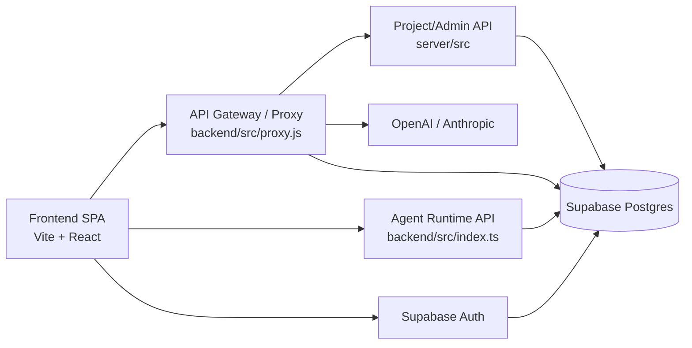

# Agentic SDLC Framework

A browser-based tool that automates the software development lifecycle using 30 AI agents, a backend API gateway, a dedicated runtime service, and PostgreSQL-backed shared state.

## Architecture



## Quick Start

### Prerequisites
- Node 20+
- Docker Desktop (for the Postgres service)

### 1. Start Postgres

```bash
docker compose up db -d
# Wait for the health-check: docker compose ps
```

### 2. Install dependencies

```bash
# Root + frontend
npm install

# Backend
cd backend && npm install && cd ..

# Shared types
cd shared-types && npm install && cd ..
```

### 3. Configure environment

```bash
cp backend/.env.example backend/.env
cp frontend/.env.example frontend/.env
```

Edit `backend/.env` and set at minimum:
- `POSTGRES_URL` - already points to Docker Postgres; change only for remote DBs
- `ANTHROPIC_API_KEY` or `OPENAI_API_KEY` - at least one LLM provider key

Edit `frontend/.env` - no secret tokens should be added here. `VITE_*` variables are bundled into the browser build and exposed publicly. API tokens stay in backend environment files.

### 4. Run migrations

```bash
cd backend && npm run migrate:up
```

### 4A. Seed master catalog data

```bash
cd backend && npm run seed:master-data
```

### 4B. Optional demo/sample project data

```bash
cd backend && npm run seed:sample-data
```

### 5. Run

```bash
# From repo root - starts frontend + legacy proxy + runtime
npm run dev

# Or start the runtime separately
cd backend && npm run runtime:dev
```

| Service | URL |
|---|---|
| Frontend | http://localhost:5173 |
| Proxy / API gateway | http://localhost:3001 |
| Agent Runtime | http://localhost:4000 |
| Runtime health | http://localhost:4000/health |
| Runtime ready | http://localhost:4000/ready |

## Running Tests

```bash
# Frontend (vitest + coverage - thresholds enforced)
cd frontend && npm run test:coverage

# Backend (jest + real Postgres)
# Requires POSTGRES_URL_TEST to be set in backend/.env
cd backend && npm run migrate:up:test && npm test

# TypeScript typecheck (all packages)
cd backend && npm run typecheck
cd shared-types && npx tsc --noEmit
```

## CI

GitHub Actions runs on every push to `main`/`dev` and on PRs:
- `backend`: tsc typecheck -> migrate test DB -> jest
- `frontend`: tsc typecheck -> vitest coverage
- `shared-types`: tsc typecheck

## Phases & Agents

| Phase | Agents | Mode |
|-------|--------|------|
| 0 - Orchestration | sdlcOrchestrator | Sequential |
| 1 - PRD | manager | Sequential |
| 1B - Foundation | projectCharter, brd | Sequential |
| 2 - Requirements Tier 1 | businessRules, stakeholder, userStory, feasibility | Parallel |
| 2A - Requirements Tier 2 | dataModel | Sequential |
| 3 - Design Tier 1 | architecture, uxResearch | Parallel |
| 3A - Design Tier 2 | apiDesign, interaction | Parallel |
| 3C - Design Tier 3 | uxMockups | Sequential |
| 3B - Security Gate | securityCompliance | Sequential |
| 4 - Dev Planning Tier 1 | codeStructure, sprintPlanner, taskBreakdown, techDebt, codeSnippets | Parallel |
| 4A - Dev Planning Tier 2 | codeReviewStandards, uiComponentLibrary, roadmapPlanner | Parallel |
| 5 - Testing | testPlan, testCases | Sequential |
| 6 - Prototype | workingPrototype | Sequential |
| 7 - DevOps | devopsEngineer, infraEngineer | Parallel |
| 8 - Operations | observabilityEngineer, onCallEngineer | Parallel |

## Features

- Multi-project dashboard with domain color coding
- 30 AI agents producing SDLC artifacts
- Simple/Expert mode
- Review gates across the pipeline
- Export each document as `.md` or `.docx`
- Postgres-backed project and app-state storage through backend APIs
