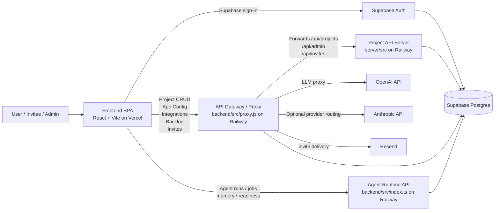
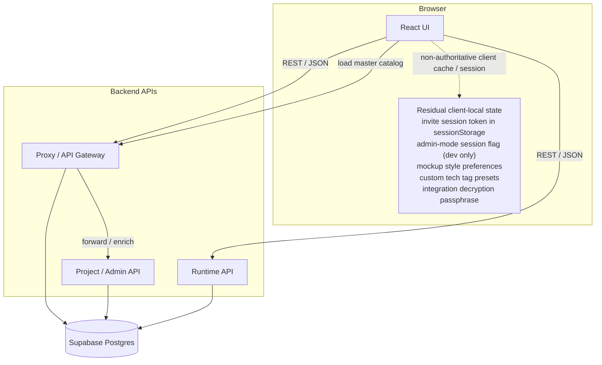
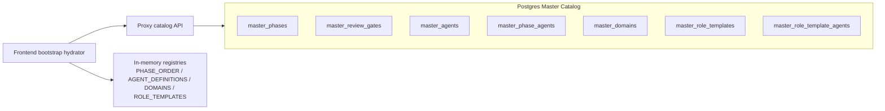
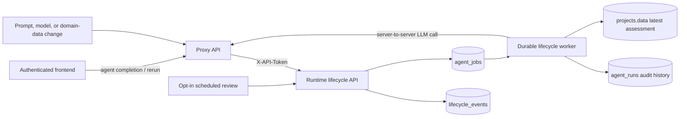

# Agentic SDLC Architecture

Last updated: 2026-08-24

This document describes the current main-branch implementation of Agentic SDLC:
a Postgres-backed, API-mediated, multi-service agentic delivery platform.

**2026-08-24 correction:** this document has always described three separate
backend services (proxy, project/admin API, runtime API — see ADR-003 below).
That was the intended design from the start (see `docs/ADR/ADR-006-runtime-consolidation.md`,
dated 2026-06-22, which documents proxy.js on port 3001 and index.ts on port
4000 as two independent processes), but it was never actually true in
production: `backend/src/proxy.js` and `backend/src/index.ts` had been sharing
a single Railway service the whole time, which can only run one of them at
once. Whichever deployed most recently silently took the other down — this is
why item #4 (pgvector) and item #5 Phase 3 (Token Optimizer citations), both
built and test-verified weeks earlier, were never actually reachable at their
production URL until today. Fixed today by provisioning a dedicated second
Railway service (`agentic-sdlc-runtime`) for `index.ts`, so the three-service
model this document describes is now genuinely deployed, not just designed.
Full incident writeup: `docs/architecture/execution-status-2026-08-24.md`.

## Current Implementation Snapshot

| Area | Current implementation |
|------|------------------------|
| Frontend | React + Vite SPA deployed on Vercel. The browser is a thin client for project/app/runtime data. |
| API gateway / LLM proxy | `backend/src/proxy.js` on Railway service **`agentic-sdlc`** (`agentic-sdlc-production-d156.up.railway.app`). Owns LLM calls, app-state APIs, master catalog API, invite/session APIs, CORS, rate limiting, chat, GitHub push, governance, feedback capture, and selected forwarding to the project API server. |
| Project/admin API | `server/src/` on Railway service **`artistic-charm`** (`artistic-charm-production-6fa7.up.railway.app`). Owns authenticated project CRUD, app-admin checks, project permissions, and canonical `team_members` role access. |
| Runtime API | `backend/src/index.ts` on Railway service **`agentic-sdlc-runtime`** (`agentic-sdlc-runtime-production.up.railway.app`), provisioned 2026-08-24 — see correction note above. Owns agent runs, jobs, memory records, pgvector semantic search, action proposals, rollback logs, `/health`, and `/ready`. Same `backend/` codebase and rootDirectory as the proxy above, but a separate Railway service with its own build/start config (`backend/railway.runtime.json`) so the two no longer compete for one process slot. |
| Identity | Supabase Auth JWT is the production identity mechanism. Local admin bypass exists only outside production. Invite sessions are project-scoped. |
| Data plane | Supabase Postgres is authoritative for projects, memberships, runtime records, app-state, integrations, backlog, master catalogs, and invite data. |
| Agent orchestration | The frontend pipeline engine still initiates phase execution and agent reruns, while runtime services persist run/job/memory telemetry. |
| LLM providers | OpenAI is the default backend provider. Claude and OpenAI-compatible model catalog entries are routed server-side when enabled. |

## Architecture Decision Records

## ADR-001: Postgres is the single source of truth

**Context:** The application now supports cloud deployment, invite-based collaboration, admin-mode access, project-scoped permissions, and shared mutable app configuration. Browser-local project storage caused drift, prevented collaboration, and made production data invisible to the backend.

**Decision:** Route all project CRUD, app configuration, integrations, backlog items, invite membership, and runtime state through backend APIs backed by PostgreSQL/Supabase.

**Consequences:** The app is now cloud-native and multi-user. Browser-local persistence is no longer authoritative for project/app state, and backend availability is required for normal operation.

## ADR-002: Staggered parallel agents with dependency tiers

**Context:** Some agents were running in the same parallel phase while still depending on each other's outputs. That caused `get_agent_output(...)` to return `found: false` for same-phase dependencies.

**Decision:** Split the pipeline into dependency tiers (`phase2a`, `phase3a`, `phase3c`, `phase4a`) so same-domain dependencies complete before downstream agents start.

**Consequences:** The pipeline remains parallel where safe, but execution order is now dependency-correct.

## ADR-003: Multi-service backend behind a single frontend API surface

**Context:** The frontend must never hold LLM secrets, but it also needs a stable API base URL in production. The system now has three backend responsibilities: proxying LLM/tool calls, handling project/app-state APIs, and running the agent runtime.

**Decision:**
- `backend/src/proxy.js` is the API gateway and LLM proxy. It authenticates Supabase JWT callers, local-development admin bypass callers, or project-scoped invite sessions; enforces admin-only access on sensitive settings/app-state endpoints; stores app-state tables in Postgres; and forwards selected routes to the API server.
- `server/src/` is the authenticated project/admin API backed by Supabase/Postgres.
- `backend/src/index.ts` is the agent runtime API for runs, jobs, memory records, action proposals, and observability endpoints.

**Consequences:** The frontend talks to a single proxy URL plus the runtime URL. Secrets remain server-side, app-state writes are centralized, and production data flows through Postgres instead of the browser.

## ADR-004: OpenAI `gpt-4o` is the default provider, Claude is optional

**Context:** OpenAI is the primary provider in production, but provider routing needs to remain configurable per agent.

**Decision:** Use OpenAI as the default provider, with Claude enabled via backend settings and per-agent routing hints where needed.

**Consequences:** Provider switching is centralized in the backend and app-state config, not hardcoded in the frontend.

## ADR-005: Lightweight markdown + Mermaid rendering in the frontend

**Context:** Agent outputs are primarily markdown documents with Mermaid diagrams and HTML mockups.

**Decision:** Keep rendering lightweight in the SPA using the existing markdown/document viewers and Mermaid preview flow, instead of introducing a heavy document runtime.

**Consequences:** Bundle size stays manageable, but large rendering libraries remain optional and selectively loaded.

## ADR-006: Master catalogs are stored in Postgres and hydrated at app startup

**Context:** Hardcoded phase maps, domain catalogs, role templates, and agent metadata drift over time and violate the requirement that master data live in Postgres rather than browser bundles.

**Decision:** Store master catalogs in dedicated Postgres tables (`master_phases`, `master_review_gates`, `master_agents`, `master_phase_agents`, `master_domains`, `master_role_templates`, `master_role_template_agents`) and hydrate the frontend registries from a backend catalog API before the app loads.

**Consequences:** The app can keep its current in-memory runtime structures, but Postgres becomes the source of truth for master catalogs and the browser bundle becomes only a fallback.

---

## System Overview

### Runtime data flow

- The frontend is a thin client. It does not own project state.
- `projectRepository.ts` loads and saves projects through backend APIs.
- App-wide mutable state such as theme, model, prompt defaults, domain defaults, integration credentials, and backlog items persists through proxy-backed Postgres tables.
- Master catalogs such as phases, review gates, agents, domains, and role templates are served from Postgres through the proxy catalog API.
- Invite access is project-scoped, accepted once, and resolved server-side through `team_members` plus `invite_sessions`. Invite creation/revocation is restricted to app Admins and that project's Owner (`authorizeInviteAction()` in `backend/src/proxy.js`); the invite token itself is never stored in plaintext — only its SHA-256 hash (`team_members.invite_token_hash`) — see `docs/security-review-2026-07-05.md`.
- The runtime API stores agent runs, jobs, memory records, and action proposals in Postgres.

### Data ownership and API flow

### Remaining client-local exceptions

- Invite access session tokens are stored only in browser sessionStorage and expire server-side.
- Admin bypass mode exists only in local development and still uses browser sessionStorage.
- UX mockup style selections and prototype style selections are still stored in browser localStorage.
- Custom technology tags in the edit-project flow are still stored in browser localStorage.
- Integration credential blobs are in Postgres, but the decryption passphrase is still generated and stored per browser device.

Master catalogs are no longer part of the gap list: they are modeled as Postgres-backed tables with API hydration. The remaining client-local items above are browser convenience state only, not the authoritative source of project or admin data.

---

## Combined Architecture and Agentic Flow

This diagram combines the platform architecture with the generated agentic flow so one view shows the cloud services, Postgres data plane, SDLC Orchestrator, Gate 0 negative workflow, downstream phase chain, and L3 thinking loop.

Use the detailed agent-flow appendix for implementation-level diagrams: [AGENTIC_AGENT_FLOW.md](architecture/AGENTIC_AGENT_FLOW.md) and [AGENT_FLOW_CATALOG.md](architecture/AGENT_FLOW_CATALOG.md).

## Master Catalog Tables

---

## Pipeline Phases and Agents

| Phase | Name | Agents | Parallel? | Review Gate |
|-------|------|--------|-----------|-------------|
| phase0 | SDLC Orchestrator | sdlcOrchestrator (1) | No | - |
| phase0a | Token Optimization | tokenOptimizer (1) | No | - |
| phase0b | AI Governance | aiGovernance (1) | No | - |
| phase1 | PRD | manager (1) | No | gate1 (after phase1 + phase1b) |
| phase1b | Foundation | projectCharter, brd (2) | No | gate1 |
| phase2 | Requirements Tier 1 | businessRules, stakeholder, userStory, feasibility (4) | Yes | gate2 after phase2a |
| phase2a | Requirements Tier 2 | dataModel (1) | No | gate2 |
| phase3 | Design Tier 1 | architecture, uxResearch (2) | Yes | gate3 after phase3 + phase3a + phase3c + phase3b |
| phase3a | Design Tier 2 | apiDesign, interaction (2) | Yes | gate3 |
| phase3c | Design Tier 3 | uxMockups (1) | No | gate3 |
| phase3b | Security Review | securityCompliance (1) | No | gate3 |
| phase4 | Dev Planning Tier 1 | codeStructure, sprintPlanner, taskBreakdown, techDebt, codeSnippets (5) | Yes | - |
| phase4a | Dev Planning Tier 2 | codeReviewStandards, uiComponentLibrary, roadmapPlanner (3) | Yes | - |
| phase5 | Testing | testPlan, testCases (2) | No | gate5 |
| phase6 | Prototype | workingPrototype (1) | No | - |
| phase7 | DevOps | devopsEngineer, infraEngineer (2) | Yes | - |
| phase8 | Operations | observabilityEngineer, onCallEngineer (2) | Yes | - |

**Total: 32 agents, 17 phases, 4 active approval gates.**

(30 agents was a stale count that also omitted phase0a/phase0b above — added them so this table's own row count and its total agree, per the item #22 agent-count correction, 2026-08-22. "17 phases" counts every row above, including the two 1-agent preflight phases; other docs describing a narrower "execution phases" subset were left as-is — that's a different, unverified claim this pass didn't check.)

Parallel tiers run with bounded concurrency. Dependency tiers were split so agents no longer start before upstream same-domain prerequisites complete.

---

## Key Files

| File | Purpose |
|------|---------|
| `frontend/src/agents/constants.ts` | Phase order, parallel phases, PHASE_AGENTS map, review gates, TOTAL_AGENTS |
| `frontend/src/agents/definitions.ts` | All 32 agent system/user prompts |
| `frontend/src/services/pipelineEngine.ts` | Phase orchestration, review gates, resume, concurrency |
| `frontend/src/db/projectRepository.ts` | Backend-backed project repository over the proxy/API server |
| `frontend/src/services/appStateApi.ts` | Backend-backed app config, integrations, and backlog APIs |
| `frontend/src/services/api.ts` | Frontend API client for proxy + runtime calls |
| `frontend/src/components/pipeline/ProjectWorkspace.tsx` | Main workspace, artifact views, reruns, review flow |
| `frontend/src/components/settings/AppSettingsModal.tsx` | App-wide API/model/theme/domain/prompt settings |
| `backend/src/proxy.js` | API gateway / LLM proxy / invite + app-state API — Railway service `agentic-sdlc` |
| `backend/src/index.ts` | Agent runtime API (runs, jobs, memory, pgvector, readiness) — Railway service `agentic-sdlc-runtime` (separate from `agentic-sdlc` since 2026-08-24) |
| `backend/railway.json` / `backend/railway.runtime.json` | Per-service Railway build/deploy config — `railway.json` is `agentic-sdlc` (proxy.js), `railway.runtime.json` is `agentic-sdlc-runtime` (index.ts). A stale, unrelated repo-root `railway.json` also exists; a service only picks it up if its own "Railway Config File" setting isn't pointed elsewhere. |
| `server/src/` | Project/admin API with Supabase JWT auth — Railway service `artistic-charm` |

---

## Security Constraints

| Key | Location | Scope |
|-----|----------|-------|
| `VITE_SUPABASE_URL` | frontend env | Public browser config |
| `VITE_SUPABASE_ANON_KEY` | frontend env | Public/anon key for Supabase auth |
| `OPENAI_API_KEY` | backend env | Secret - backend only |
| `ANTHROPIC_API_KEY` | backend env | Secret - backend only |
| `PROXY_TOKEN` | backend env | Shared fallback auth for admin-mode / service-to-service use |
| `ADMIN_EMAIL_ALLOWLIST` | backend env | Backend-only allowlist for privileged admin routes |
| `SUPABASE_SERVICE_KEY` | server env | Secret - server only |
| `RUNTIME_API_TOKEN` | runtime env | Secret - runtime API protection |

The frontend never holds secret provider keys, proxy shared secrets, or production admin credentials. All LLM calls, app-state writes, project CRUD, and invite flows go through backend services, with Postgres as the authoritative store.

---

## Operational Verification Checklist

Use these checks when validating the deployed architecture:

| Check | Expected result |
|------|-----------------|
| Frontend URL | Vercel SPA loads and initializes the master catalog without a catalog error. |
| Proxy health | `GET https://agentic-sdlc-production.up.railway.app/api/health` returns `status: ok`, selected model, and provider flags. |
| Project/admin API | `GET /api/projects/permissions/me` succeeds only with a valid Supabase JWT or approved local-dev bypass. |
| Runtime health | Runtime `/health` returns 200; `/ready` confirms Postgres connectivity. |
| Master catalog | `GET /api/master-data/catalog` returns phases, agents, review gates, domains, and role templates from Postgres-backed tables. |
| Project CRUD | Create, list, update, archive, and restore project flows call backend APIs and persist in Supabase Postgres. |
| Invite flow | Invite links are project-scoped, non-admin by default, and resolved through backend invite/session APIs. |
| Agent calls | Frontend agent execution calls the proxy; provider keys are never exposed to the browser. |

## Architecture Documentation and Diagram Skill Recommendations

| Need | Recommended skill | Why |
|------|-------------------|-----|
| Architecture review and target-state design | `engineering:architecture` | Best fit for validating system boundaries, data ownership, deployment topology, and tradeoffs. |
| Implementation plan before code/docs changes | `superpowers:writing-plans` | Produces step-by-step implementation plans with files, validation, and acceptance criteria. |
| Code-level safety review | `engineering:code-review` | Best fit for security, correctness, performance, and maintainability findings. |
| Polished document output | `anthropic-skills:docx` or `documents:documents` | Best for creating stakeholder-ready architecture documents beyond Markdown. |
| Diagram as an image | `visualize:visualize` or `figma:figma-generate-diagram` | Best when the diagram must be a rendered image instead of Mermaid text. Use `figma` for presentation-grade editable diagrams and `visualize` for fast static diagrams. |
| Deployment architecture validation | `engineering:deploy-checklist` | Best for checking env vars, health endpoints, CORS, and production readiness. |

For future executive architecture packs, the recommended sequence is: `engineering:architecture` -> `visualize:visualize` or `figma:figma-generate-diagram` -> `anthropic-skills:docx`/`pptx`.

---

## Agentic Agent Flow

The following diagram shows how the SDLC Orchestrator starts the pipeline, what happens when Gate 0 is not approved, and how downstream L3-enabled agents perform input -> planning -> thinking loop -> output behavior.

See the detailed Mermaid source and explanation in [AGENTIC_AGENT_FLOW.md](architecture/AGENTIC_AGENT_FLOW.md), and the per-agent input/planning/output catalog in [AGENT_FLOW_CATALOG.md](architecture/AGENT_FLOW_CATALOG.md).

## Background Optimization and AI Governance Lifecycle

The Token Optimizer Agent and AI Governance Agent are internal agents. They are not rendered in the normal workspace, review-gate artifact tabs, progress totals, or user exports. Their latest results remain in `projects.data.agentRuns`, while each execution is retained as an append-only `agent_runs` record for admin audit.

Lifecycle events are idempotent per project and event key. Jobs are claimed atomically with `FOR UPDATE SKIP LOCKED`, retry with backoff, and stop after the configured retry limit. When the browser does not provide context, the runtime resolves the active governed prompt, project state, and master-agent metadata from Postgres. Scheduled reviews are disabled by default and require `BACKGROUND_SCHEDULED_REVIEW_HOURS` to avoid unapproved recurring model spend.

Deployment requires migration `009_background_agent_lifecycle.sql`. The proxy service requires `RUNTIME_API_URL` and `RUNTIME_API_TOKEN`; the runtime requires `PROXY_API_URL`, `PROXY_TOKEN`, and `BACKGROUND_WORKER_ENABLED=true`.
