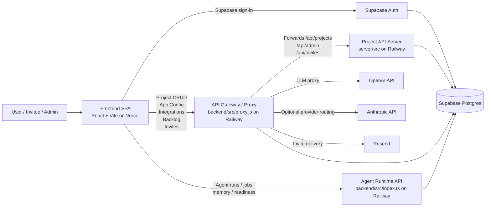
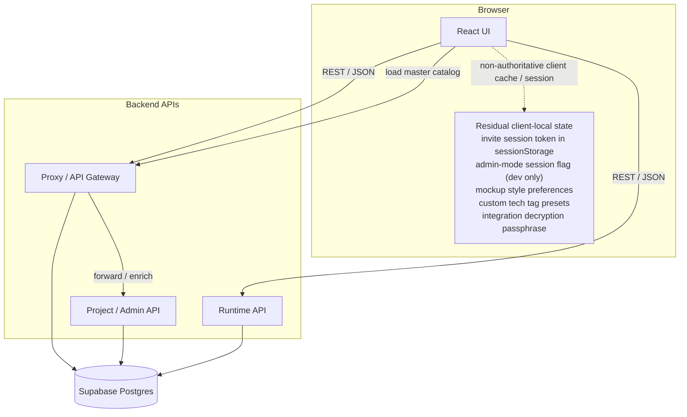
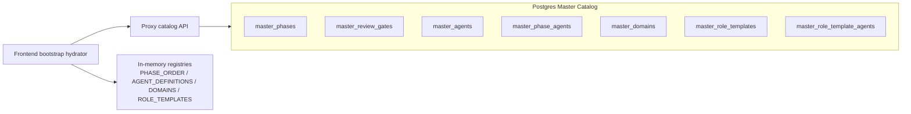

# Architecture Decision Records

## ADR-001: Postgres is the single source of truth

**Context:** The application now supports cloud deployment, invite-based collaboration, admin-mode access, project-scoped permissions, and shared mutable app configuration. Browser-local project storage caused drift, prevented collaboration, and made production data invisible to the backend.

**Decision:** Route all project CRUD, app configuration, integrations, backlog items, invite membership, and runtime state through backend APIs backed by PostgreSQL/Supabase.

**Consequences:** The app is now cloud-native and multi-user. Browser-local persistence is no longer authoritative for project/app state, and backend availability is required for normal operation.

## ADR-002: Staggered parallel agents with dependency tiers

**Context:** Some agents were running in the same parallel phase while still depending on each other's outputs. That caused `get_agent_output(...)` to return `found: false` for same-phase dependencies.

**Decision:** Split the pipeline into dependency tiers (`phase2a`, `phase3a`, `phase3c`, `phase4a`) so same-domain dependencies complete before downstream agents start.

**Consequences:** The pipeline remains parallel where safe, but execution order is now dependency-correct.

## ADR-003: Multi-service backend behind a single frontend API surface

**Context:** The frontend must never hold LLM secrets, but it also needs a stable API base URL in production. The system now has three backend responsibilities: proxying LLM/tool calls, handling project/app-state APIs, and running the agent runtime.

**Decision:**
- `backend/src/proxy.js` is the API gateway and LLM proxy. It authenticates Supabase JWT callers, local-development admin bypass callers, or project-scoped invite sessions; enforces admin-only access on sensitive settings/app-state endpoints; stores app-state tables in Postgres; and forwards selected routes to the API server.
- `server/src/` is the authenticated project/admin API backed by Supabase/Postgres.
- `backend/src/index.ts` is the agent runtime API for runs, jobs, memory records, action proposals, and observability endpoints.

**Consequences:** The frontend talks to a single proxy URL plus the runtime URL. Secrets remain server-side, app-state writes are centralized, and production data flows through Postgres instead of the browser.

## ADR-004: OpenAI `gpt-4o` is the default provider, Claude is optional

**Context:** OpenAI is the primary provider in production, but provider routing needs to remain configurable per agent.

**Decision:** Use OpenAI as the default provider, with Claude enabled via backend settings and per-agent routing hints where needed.

**Consequences:** Provider switching is centralized in the backend and app-state config, not hardcoded in the frontend.

## ADR-005: Lightweight markdown + Mermaid rendering in the frontend

**Context:** Agent outputs are primarily markdown documents with Mermaid diagrams and HTML mockups.

**Decision:** Keep rendering lightweight in the SPA using the existing markdown/document viewers and Mermaid preview flow, instead of introducing a heavy document runtime.

**Consequences:** Bundle size stays manageable, but large rendering libraries remain optional and selectively loaded.

## ADR-006: Master catalogs are stored in Postgres and hydrated at app startup

**Context:** Hardcoded phase maps, domain catalogs, role templates, and agent metadata drift over time and violate the requirement that master data live in Postgres rather than browser bundles.

**Decision:** Store master catalogs in dedicated Postgres tables (`master_phases`, `master_review_gates`, `master_agents`, `master_phase_agents`, `master_domains`, `master_role_templates`, `master_role_template_agents`) and hydrate the frontend registries from a backend catalog API before the app loads.

**Consequences:** The app can keep its current in-memory runtime structures, but Postgres becomes the source of truth for master catalogs and the browser bundle becomes only a fallback.

---

## System Overview

### Runtime data flow

- The frontend is a thin client. It does not own project state.
- `projectRepository.ts` loads and saves projects through backend APIs.
- App-wide mutable state such as theme, model, prompt defaults, domain defaults, integration credentials, and backlog items persists through proxy-backed Postgres tables.
- Master catalogs such as phases, review gates, agents, domains, and role templates are served from Postgres through the proxy catalog API.
- Invite access is project-scoped, accepted once, and resolved server-side through `team_members` plus `invite_sessions`.
- The runtime API stores agent runs, jobs, memory records, and action proposals in Postgres.

### Data ownership and API flow

### Remaining client-local exceptions

- Invite access session tokens are stored only in browser sessionStorage and expire server-side.
- Admin bypass mode exists only in local development and still uses browser sessionStorage.
- UX mockup style selections and prototype style selections are still stored in browser localStorage.
- Custom technology tags in the edit-project flow are still stored in browser localStorage.
- Integration credential blobs are in Postgres, but the decryption passphrase is still generated and stored per browser device.

Master catalogs are no longer part of the gap list: they are modeled as Postgres-backed tables with API hydration. The remaining client-local items above are browser convenience state only, not the authoritative source of project or admin data.

---

## Master Catalog Tables

---

## Pipeline Phases and Agents

| Phase | Name | Agents | Parallel? | Review Gate |
|-------|------|--------|-----------|-------------|
| phase0 | SDLC Orchestrator | sdlcOrchestrator (1) | No | - |
| phase1 | PRD | manager (1) | No | gate1 (after phase1 + phase1b) |
| phase1b | Foundation | projectCharter, brd (2) | No | gate1 |
| phase2 | Requirements Tier 1 | businessRules, stakeholder, userStory, feasibility (4) | Yes | gate2 after phase2a |
| phase2a | Requirements Tier 2 | dataModel (1) | No | gate2 |
| phase3 | Design Tier 1 | architecture, uxResearch (2) | Yes | gate3 after phase3 + phase3a + phase3c + phase3b |
| phase3a | Design Tier 2 | apiDesign, interaction (2) | Yes | gate3 |
| phase3c | Design Tier 3 | uxMockups (1) | No | gate3 |
| phase3b | Security Review | securityCompliance (1) | No | gate3 |
| phase4 | Dev Planning Tier 1 | codeStructure, sprintPlanner, taskBreakdown, techDebt, codeSnippets (5) | Yes | - |
| phase4a | Dev Planning Tier 2 | codeReviewStandards, uiComponentLibrary, roadmapPlanner (3) | Yes | - |
| phase5 | Testing | testPlan, testCases (2) | No | gate5 |
| phase6 | Prototype | workingPrototype (1) | No | - |
| phase7 | DevOps | devopsEngineer, infraEngineer (2) | Yes | - |
| phase8 | Operations | observabilityEngineer, onCallEngineer (2) | Yes | - |

**Total: 30 agents, 15 execution phases, 4 active approval gates.**

Parallel tiers run with bounded concurrency. Dependency tiers were split so agents no longer start before upstream same-domain prerequisites complete.

---

## Key Files

| File | Purpose |
|------|---------|
| `frontend/src/agents/constants.ts` | Phase order, parallel phases, PHASE_AGENTS map, review gates, TOTAL_AGENTS |
| `frontend/src/agents/definitions.ts` | All 30 agent system/user prompts |
| `frontend/src/services/pipelineEngine.ts` | Phase orchestration, review gates, resume, concurrency |
| `frontend/src/db/projectRepository.ts` | Backend-backed project repository over the proxy/API server |
| `frontend/src/services/appStateApi.ts` | Backend-backed app config, integrations, and backlog APIs |
| `frontend/src/services/api.ts` | Frontend API client for proxy + runtime calls |
| `frontend/src/components/pipeline/ProjectWorkspace.tsx` | Main workspace, artifact views, reruns, review flow |
| `frontend/src/components/settings/AppSettingsModal.tsx` | App-wide API/model/theme/domain/prompt settings |
| `backend/src/proxy.js` | API gateway / LLM proxy / invite + app-state API |
| `backend/src/index.ts` | Agent runtime API (runs, jobs, memory, readiness) |
| `server/src/` | Project/admin API with Supabase JWT auth |

---

## Security Constraints

| Key | Location | Scope |
|-----|----------|-------|
| `VITE_SUPABASE_URL` | frontend env | Public browser config |
| `VITE_SUPABASE_ANON_KEY` | frontend env | Public/anon key for Supabase auth |
| `OPENAI_API_KEY` | backend env | Secret - backend only |
| `ANTHROPIC_API_KEY` | backend env | Secret - backend only |
| `PROXY_TOKEN` | backend env | Shared fallback auth for admin-mode / service-to-service use |
| `ADMIN_EMAIL_ALLOWLIST` | backend env | Backend-only allowlist for privileged admin routes |
| `SUPABASE_SERVICE_KEY` | server env | Secret - server only |
| `RUNTIME_API_TOKEN` | runtime env | Secret - runtime API protection |

The frontend never holds secret provider keys, proxy shared secrets, or production admin credentials. All LLM calls, app-state writes, project CRUD, and invite flows go through backend services, with Postgres as the authoritative store.
